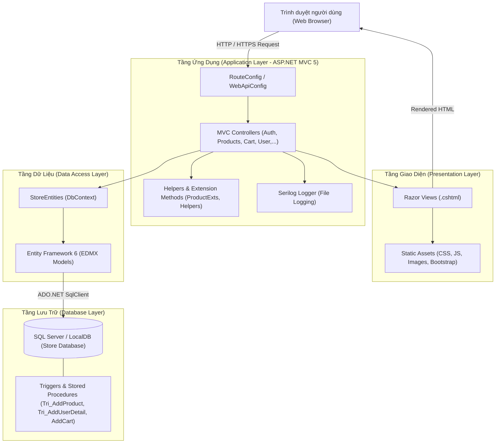
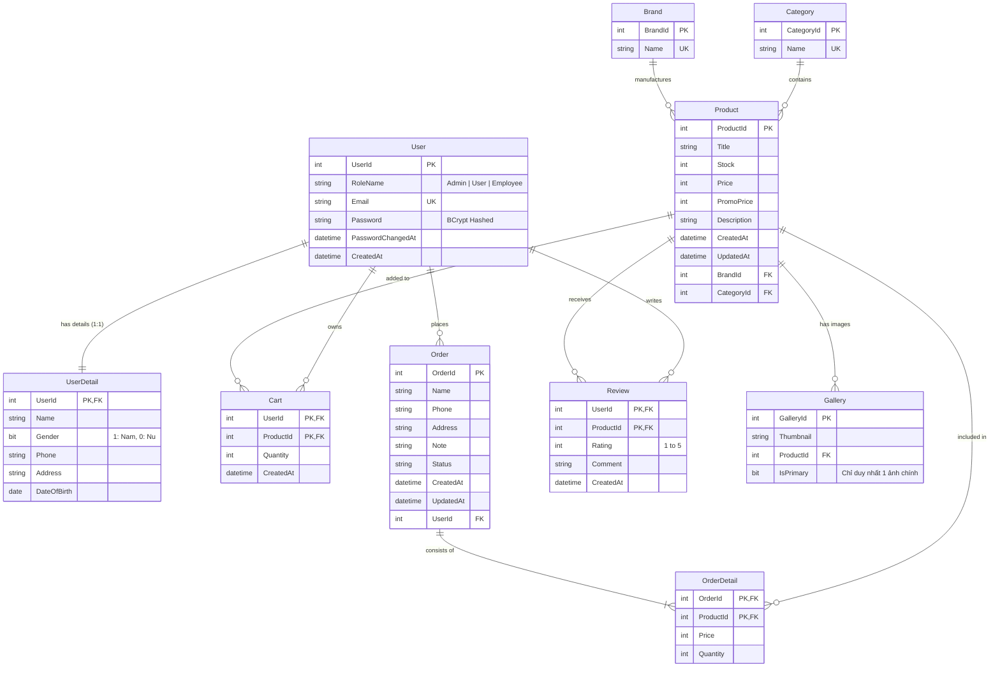

# TÀI LIỆU TỔNG QUAN DỰ ÁN: ECOMMERCE COMPUTER (STORE EF)

> **Dự án:** Hệ thống Website Thương Mại Điện Tử Kinh Doanh Máy Tính & Thiết Bị Công Nghệ  
> **Phiên bản:** V3  
> **Ngôn ngữ & Nền tảng:** C# / .NET Framework 4.7.2 / ASP.NET MVC 5 / Entity Framework 6  
> **Mục đích:** Phục vụ học tập, phát triển ứng dụng web và thực hành môn **Kiểm thử phần mềm (Software Testing & QA)**  

---

## MỤC LỤC
1. [Giới thiệu tổng quan](#1-giới-thiệu-tổng-quan)
2. [Kiến trúc & Công nghệ sử dụng](#2-kiến-trúc--công-nghệ-sử-dụng)
3. [Cấu trúc thư mục dự án](#3-cấu-trúc-thư-mục-dự-án)
4. [Mô hình Dữ liệu & Thiết kế CSDL (Database Design)](#4-mô-hình-dữ-liệu--thiết-kế-csdl-database-design)
5. [Các phân hệ chức năng & Phân quyền (Roles & Features)](#5-các-phân-hệ-chức-năng--phân-quyền-roles--features)
6. [Định hướng & Trọng tâm Kiểm thử phần mềm (Testing Scope)](#6-định-hướng--trọng-tâm-kiểm-thử-phần-mềm-testing-scope)
7. [Hướng dẫn Cài đặt, Cấu hình & Vận hành](#7-hướng-dẫn-cài-đặt-cấu-hình--vận-hành)
8. [Tài khoản kiểm thử mặc định](#8-tài-khoản-kiểm-thử-mặc-định)

---

## 1. Giới thiệu tổng quan

**EcommerceComputer-V3 (Store EF)** là một ứng dụng web thương mại điện tử chuyên cung cấp máy tính xách tay (laptop), máy tính để bàn (desktop), màn hình, linh kiện và phụ kiện công nghệ từ các thương hiệu nổi tiếng (Dell, HP, Asus, Lenovo, Acer,...).

### 1.1. Mục tiêu dự án
* Xây dựng một nền tảng bán hàng trực tuyến hoàn chỉnh hỗ trợ người mua tra cứu, tìm kiếm, xem thông tin sản phẩm, quản lý giỏ hàng và đặt hàng.
* Cung cấp phân hệ quản trị (Back-office/Admin) phục vụ quản lý danh mục, thương hiệu, sản phẩm kèm hình ảnh và phân quyền người dùng.
* Cung cấp một ứng dụng chuẩn mô hình MVC để làm đối tượng kiểm thử thực tế cho môn **Kiểm thử phần mềm**, bao gồm:
  * Viết và thực thi Unit Test (Kiểm thử đơn vị).
  * Kiểm thử chức năng (Functional Testing) theo các luồng nghiệp vụ.
  * Kiểm thử giao diện và tương thích (UI/UX & Cross-Browser Testing).
  * Kiểm thử bảo mật (Security Testing: xác thực, phân quyền, mã hóa mật khẩu, SQL Injection, validation).
  * Ghi nhận và báo cáo lỗi (Bug Reporting & Defect Tracking).

---

## 2. Kiến trúc & Công nghệ sử dụng

### 2.1. Ngăn xếp công nghệ (Tech Stack)

| Tầng | Công nghệ / Thư viện | Phiên bản | Ghi chú |
| :--- | :--- | :--- | :--- |
| **Nền tảng chính** | .NET Framework | 4.7.2 | Nền tảng thực thi ứng dụng Windows |
| **Kiến trúc Web** | ASP.NET MVC | 5.3.0 | Mô hình MVC phân tách rõ Controller, View, Model |
| **ORM / Data Access** | Entity Framework | 6.4.4 | Tiếp cận theo mô hình **Database-First** (`StoreDb.edmx`) |
| **Cơ sở dữ liệu** | SQL Server / LocalDB | 2016+ | CSDL chính (`MSSQLLocalDB`, DB name: `Store`) |
| **CSDL thay thế** | PostgreSQL / Supabase | 14+ | Hỗ trợ qua script chuyển đổi `schema_supabase.sql` |
| **Bảo mật & Hash** | BCrypt.Net-Next | 4.0.3 | Mã hóa muối (salt) và hash mật khẩu người dùng |
| **Logging** | Serilog & Serilog.Sinks.File | 4.0.2 / 6.0.0 | Ghi log ngoại lệ tự động ra file theo ngày (`Logs/dd-MM-yyyy.txt`) |
| **Phân trang** | PagedList / PagedList.Mvc | 1.17 / 4.5 | Hỗ trợ phân trang sản phẩm và danh sách tài khoản |
| **Frontend UI** | HTML5, CSS3, JavaScript | ES6 | Giao diện Responsive tùy biến |
| **CSS Framework** | Bootstrap | 5.3.3 | Hỗ trợ bố cục và UI components |
| **Thư viện Client** | jQuery & jQuery Validation | 3.7.1 / 1.21.0 | Xử lý DOM, AJAX và Client-side Form Validation |
| **Unit Testing** | MSTest (VSTest) | 1.2.0 | Framework viết kiểm thử đơn vị trong `Store.Tests` |
| **Máy chủ Web & Build** | IIS Express & Roslyn csc | 4.1.0 | Biên dịch độc lập qua Roslyn và chạy trên IIS Express (port 5000) |

### 2.2. Sơ đồ kiến trúc tổng thể (High-Level Architecture)



---

## 3. Cấu trúc thư mục dự án

```
EcommerceComputer-V3/
│
├── Store.sln                     # File Solution quản lý giải pháp Visual Studio
├── Store.sql                     # Script T-SQL tạo CSDL, Trigger, Store Procedure, Dữ liệu mẫu (SQL Server)
├── schema_supabase.sql           # Script CSDL chuyển đổi tương thích PostgreSQL / Supabase
├── build.ps1                     # PowerShell script tự động biên dịch dự án bằng Roslyn csc.exe
├── run.bat                       # Batch script khởi động LocalDB, build và chạy IIS Express tại port 5000
├── run.ps1                       # PowerShell script hỗ trợ khởi chạy dự án
├── run.txt                       # Ghi chú hướng dẫn các câu lệnh chạy nhanh
├── nuget.exe                     # Công cụ CLI quản lý gói NuGet
│
├── Docs/                         # THƯ MỤC TÀI LIỆU DỰ ÁN
│   └── PROJECT_OVERVIEW.md       # Tài liệu mô tả tổng quan dự án (File hiện tại)
│
├── packages/                     # Thư viện NuGet đã restore (EF, MVC, BCrypt, Serilog,...)
│
├── Store EF/                     # DỰ ÁN WEB CHÍNH (ASP.NET MVC 5 Application)
│   ├── App_Start/                # Cấu hình Bundle, Filter, Route, WebApi
│   │   ├── BundleConfig.cs
│   │   ├── FilterConfig.cs
│   │   ├── RouteConfig.cs
│   │   └── WebApiConfig.cs
│   │
│   ├── Controllers/              # Bộ điều khiển tiếp nhận và xử lý yêu cầu nghiệp vụ
│   │   ├── AuthController.cs         # Đăng ký, Đăng nhập, Đăng xuất, mã hóa BCrypt
│   │   ├── HomeController.cs         # Trang chủ, hiển thị sản phẩm giảm giá/nổi bật
│   │   ├── ProductsController.cs     # Danh sách, lọc, tìm kiếm, xem chi tiết, CRUD sản phẩm
│   │   ├── CartController.cs         # Quản lý giỏ hàng (thêm, cập nhật số lượng, xóa)
│   │   ├── CheckOutController.cs     # Đặt hàng và tiến hành thanh toán
│   │   ├── UserAccountController.cs  # Hồ sơ cá nhân, đổi mật khẩu, quản lý người dùng
│   │   ├── BrandsController.cs       # Danh sách và thêm thương hiệu
│   │   └── CategoriesController.cs   # Danh sách và thêm danh mục
│   │
│   ├── Models/                   # Mô hình thực thể và dữ liệu
│   │   ├── StoreDb.edmx              # Sơ đồ Entity Framework Database First
│   │   ├── StoreDb.Context.cs        # DbContext đại diện kết nối CSDL (StoreEntities)
│   │   ├── Product.cs, Brand.cs, Category.cs, Gallery.cs, Cart.cs, Order_.cs, User_.cs...
│   │   └── Extensions/               # Lớp mở rộng chứa business logic tiện ích
│   │       ├── ProductExts.cs        # Kiểm tra tính hợp lệ, định dạng giá, chiết khấu, CRUD DB
│   │       ├── ProductsExts.cs       # Tính toán số trang tối đa (MaxPage)
│   │       └── CartExts.cs
│   │
│   ├── Views/                    # Giao diện hiển thị người dùng (Razor .cshtml)
│   │   ├── Auth/                     # Giao diện Đăng nhập (SignIn), Đăng ký (SignUp)
│   │   ├── Home/                     # Giao diện Trang chủ (Index)
│   │   ├── Products/                 # Giao diện Danh sách, Chi tiết, Thêm, Sửa, Quản lý sản phẩm
│   │   ├── Cart/                     # Giao diện Giỏ hàng
│   │   ├── CheckOut/                 # Giao diện Đặt hàng / Thanh toán
│   │   ├── UserAccount/              # Giao diện Hồ sơ cá nhân, Đổi mật khẩu, Quản lý người dùng
│   │   └── Shared/                   # Layout dùng chung (_Layout, _Header, _Footer, _Hero, Error)
│   │
│   ├── Content/                  # CSS và tài nguyên định kiểu mặc định
│   ├── Public/                   # Tài nguyên tĩnh tự định nghĩa (CSS, JS, Fonts, Images upload)
│   ├── Logs/                     # Thư mục lưu file nhật ký hệ thống (Serilog tạo theo ngày)
│   ├── Helpers.cs                # Các hàm tiện ích: Validate Email, Validate Image, Hash MD5/SHA256
│   ├── Global.asax / .cs         # Vòng đời ứng dụng, cấu hình khởi tạo Serilog và Routing
│   ├── Web.config                # Cấu hình máy chủ, chuỗi kết nối CSDL, assembly binding
│   └── packages.config           # Danh sách các gói NuGet phụ thuộc
│
└── Store.Tests/                  # DỰ ÁN KIỂM THỬ ĐƠN VỊ (UNIT TEST PROJECT)
    ├── Controllers/
    │   └── HomeControllerTest.cs # Unit test kiểm tra Action Index của HomeController
    ├── TestSomething.cs          # Unit test kiểm tra hàm tiện ích FormattedPrice của Product
    ├── App.config                # Cấu hình môi trường cho Test Runner
    ├── packages.config           # Gói thư viện phụ thuộc của dự án test
    └── Store.Tests.csproj        # File dự án MSTest
```

---

## 4. Mô hình Dữ liệu & Thiết kế CSDL (Database Design)

CSDL chính có tên là `Store`, được thiết kế chuẩn hóa và có các ràng buộc toàn vẹn dữ liệu chặt chẽ cùng các Trigger tự động hóa nghiệp vụ.

### 4.1. Sơ đồ Quan hệ Thực thể (Entity Relationship Diagram - ERD)



### 4.2. Chi tiết các bảng dữ liệu

1. **`User@` (Người dùng):**
   * Lưu trữ tài khoản người dùng đăng nhập hệ thống.
   * `UserId`: Khóa chính (Identity tự tăng).
   * `RoleName`: Vai trò tài khoản (`Admin`, `User`, `Employee`). Mặc định: `'User'`.
   * `Email`: Email đăng nhập duy nhất (Unique), định dạng tối đa 320 ký tự.
   * `Password`: Chuỗi mã hóa BCrypt bảo mật độ dài 255 ký tự.
   * `PasswordChangedAt`, `CreatedAt`: Dấu thời gian thay đổi mật khẩu và tạo tài khoản.

2. **`UserDetail` (Thông tin chi tiết người dùng):**
   * Quan hệ 1-1 với `User@`, `UserId` vừa là khóa chính vừa là khóa ngoại liên kết tới `User@(UserId)` với cơ chế `ON DELETE CASCADE`.
   * Lưu trữ: `Name`, `Gender` (Nam/Nữ), `Phone`, `Address`, `DateOfBirth`.

3. **`Brand` (Thương hiệu):**
   * Quản lý các hãng máy tính: `BrandId` (PK), `Name` (Unique: Dell, HP, Asus, Lenovo, Acer...).

4. **`Category` (Danh mục sản phẩm):**
   * Quản lý phân loại sản phẩm: `CategoryId` (PK), `Name` (Unique: Laptop, Desktop, Tablet, Monitor, Accessory...).

5. **`Product` (Sản phẩm):**
   * Bảng trung tâm lưu trữ thông tin sản phẩm: `ProductId` (PK), `Title`, `Stock` (tồn kho), `Price` (giá gốc), `PromoPrice` (giá khuyến mãi), `Description`, liên kết khóa ngoại với `BrandId` và `CategoryId`.

6. **`Gallery` (Thư viện hình ảnh sản phẩm):**
   * Lưu trữ danh sách hình ảnh cho từng sản phẩm: `GalleryId` (PK), `Thumbnail` (tên file ảnh), `ProductId` (FK), `IsPrimary` (đánh dấu ảnh đại diện chính).

7. **`Cart` (Giỏ hàng):**
   * Khóa chính kết hợp (`UserId`, `ProductId`), lưu `Quantity` (số lượng mua) và `CreatedAt`. Khi sản phẩm bị xóa thì dữ liệu giỏ hàng tương ứng tự động bị xóa (`ON DELETE CASCADE`).

8. **`Order@` & `OrderDetail` (Đơn hàng & Chi tiết đơn hàng):**
   * `Order@`: Lưu thông tin nhận hàng (`Name`, `Phone`, `Address`, `Note`, `Status`, `UserId`).
   * `OrderDetail`: Lưu các mặt hàng trong đơn, giá tại thời điểm mua (`Price`), số lượng (`Quantity`). Khóa chính kết hợp (`OrderId`, `ProductId`).

9. **`Review` (Đánh giá sản phẩm):**
   * Khóa chính kết hợp (`UserId`, `ProductId`), lưu điểm số đánh giá (`Rating`) và nhận xét (`Comment`).

### 4.3. Các Trigger và Stored Procedure nghiệp vụ trong CSDL

* **Trigger `Tri_AddProduct` (After Insert trên bảng `Product`):**  
  Tự động thêm một bản ghi vào bảng `Gallery` với `IsPrimary = 1` mỗi khi một sản phẩm mới được tạo.
* **Trigger `Tri_AddUserDetail` (After Insert trên bảng `User@`):**  
  Tự động sinh một dòng chi tiết `UserDetail` với tên mặc định được cắt từ tiền tố Email (trước ký tự `@`) khi người dùng mới đăng ký.
* **Trigger `Tri_AddGallery` (After Insert, Update trên bảng `Gallery`):**  
  Kiểm tra ràng buộc nghiệp vụ: Mỗi sản phẩm chỉ được phép có tối đa một hình ảnh chính (`IsPrimary = 1`). Nếu vượt quá, giao dịch sẽ bị hủy (`ROLLBACK TRANSACTION`) kèm thông báo lỗi.
* **Stored Procedure `AddCart` (`@userId`, `@productId`):**  
  Tự động kiểm tra sản phẩm đã có trong giỏ hàng hay chưa; nếu chưa có thì thêm mới với số lượng 1, nếu đã có thì cộng thêm số lượng 1.

---

## 5. Các phân hệ chức năng & Phân quyền (Roles & Features)

### 5.1. Ma trận phân quyền (Role-Based Access Matrix)

| Chức năng | Khách (Guest) | Khách hàng (User) | Nhân viên (Employee) | Quản trị viên (Admin) |
| :--- | :---: | :---: | :---: | :---: |
| Xem trang chủ, duyệt danh mục & thương hiệu | :white_check_mark: | :white_check_mark: | :white_check_mark: | :white_check_mark: |
| Tìm kiếm sản phẩm (theo từ khóa, giá, hãng) | :white_check_mark: | :white_check_mark: | :white_check_mark: | :white_check_mark: |
| Xem chi tiết thông tin và ảnh sản phẩm | :white_check_mark: | :white_check_mark: | :white_check_mark: | :white_check_mark: |
| Đăng ký tài khoản mới & Đăng nhập | :white_check_mark: | :white_check_mark: | :white_check_mark: | :white_check_mark: |
| Quản lý giỏ hàng (Thêm, Sửa số lượng, Xóa) | :x: | :white_check_mark: | :white_check_mark: | :white_check_mark: |
| Đặt hàng / Thanh toán (CheckOut) | :x: | :white_check_mark: | :white_check_mark: | :white_check_mark: |
| Xem và cập nhật hồ sơ cá nhân, đổi mật khẩu | :x: | :white_check_mark: | :white_check_mark: | :white_check_mark: |
| Quản lý sản phẩm (Thêm mới, upload ảnh, sửa) | :x: | :x: | :white_check_mark: | :white_check_mark: |
| Xóa sản phẩm | :x: | :x: | :white_check_mark: | :white_check_mark: |
| Quản lý thương hiệu & danh mục (Thêm mới) | :x: | :x: | :white_check_mark: | :white_check_mark: |
| Quản lý người dùng (Xem danh sách, sửa quyền, xóa) | :x: | :x: | :x: | :white_check_mark: |

### 5.2. Chi tiết các luồng nghiệp vụ chính

#### A. Phân hệ Xác thực (Authentication Module - `AuthController`)
* **Đăng ký (Sign Up):**
  * Kiểm tra hợp lệ định dạng email qua lớp `Helpers.IsValidEmail`.
  * Ràng buộc độ dài mật khẩu tối thiểu 6 ký tự.
  * Mã hóa mật khẩu bằng thuật toán **BCrypt** trước khi ghi vào CSDL.
  * Gán vai trò mặc định là `User`.
* **Đăng nhập (Sign In):**
  * Đối chiếu email trong CSDL.
  * Xác thực mật khẩu thông qua `BCrypt.Net.BCrypt.Verify`.
  * Lưu trữ định danh phiên làm việc vào `Session["UserId"]`, `Session["Email"]`, `Session["RoleName"]`.
* **Đăng xuất (Logout):** Xóa toàn bộ dữ liệu Session (`Session.Clear()`) và chuyển hướng về trang Đăng nhập.

#### B. Phân hệ Sản phẩm (Product Catalog & Management - `ProductsController`)
* **Trang chủ & Danh sách:**
  * Hiển thị sản phẩm còn tồn kho (`Stock > 0`).
  * Bộ lọc đa tiêu chí: theo Danh mục (Category) và Thương hiệu (Brand).
  * Phân trang tự động (mặc định 8 sản phẩm/trang) bằng `PagedList`.
* **Tìm kiếm (Search):** Tìm kiếm sản phẩm theo tiêu đề sử dụng biểu thức chính quy (Regex).
* **Chi tiết sản phẩm (Detail):** Hiển thị đầy đủ thông số kỹ thuật, mô tả, giá gốc, giá khuyến mãi (tính tỷ lệ % giảm) và toàn bộ bộ sưu tập hình ảnh liên quan.
* **Quản trị sản phẩm (Add/Update/Delete):**
  * Thêm sản phẩm kèm ảnh chính (Thumbnail) và nhiều ảnh phụ (Galleries).
  * Validate ảnh tải lên bằng `Helpers.IsValidImage` (kiểm tra stream hình ảnh hợp lệ).
  * Lưu trữ file ảnh lên thư mục vật lý `Public/Imgs/Products/` với tên file GUID duy nhất.
  * Cập nhật thông tin chi tiết, thay đổi ảnh chính hoặc bổ sung ảnh mới.
  * Xóa sản phẩm và xóa ràng buộc liên quan.

#### C. Phân hệ Giỏ hàng & Thanh toán (Cart & CheckOut - `CartController`, `CheckOutController`)
* **Thêm vào giỏ hàng:** Người dùng đã đăng nhập có thể thêm sản phẩm từ trang chi tiết hoặc danh sách. Nếu sản phẩm đã tồn tại trong giỏ thì tăng số lượng.
* **Xem giỏ hàng:** Hiển thị danh sách các món hàng, đơn giá, số lượng, tổng tiền tạm tính.
* **Thanh toán:** Điều hướng tới màn hình CheckOut để người dùng nhập thông tin giao hàng, số điện thoại, địa chỉ và ghi chú đơn hàng.

#### D. Phân hệ Quản lý Tài khoản & Người dùng (User Account & Administration - `UserAccountController`)
* **Hồ sơ cá nhân (Profile):** Cho phép người dùng xem và cập nhật Họ tên, Giới tính, Ngày sinh, Số điện thoại và Địa chỉ.
* **Đổi mật khẩu:** Yêu cầu nhập mật khẩu hiện tại (kiểm tra qua BCrypt), xác nhận mật khẩu mới khớp nhau trước khi cập nhật.
* **Quản trị người dùng (User Management - Dành cho Admin):**
  * Xem danh sách toàn bộ người dùng kèm phân trang.
  * Thêm tài khoản mới trực tiếp với các quyền hạn: `Admin`, `Employee`, `User`.
  * Thay đổi vai trò hoặc thông tin email.
  * Xóa tài khoản người dùng kèm theo chi tiết liên quan.

---

## 6. Định hướng & Trọng tâm Kiểm thử phần mềm (Testing Scope)

Là một đối tượng trong môn học/đồ án **Kiểm thử phần mềm**, dự án cung cấp nhiều khía cạnh kỹ thuật và nghiệp vụ phong phú để thiết kế kịch bản test:

### 6.1. Kiểm thử Đơn vị (Unit Testing)
Các hàm nghiệp vụ và tiện ích độc lập lý tưởng để áp dụng kỹ thuật kiểm thử hộp trắng (White-box Testing), kiểm thử biên (Boundary Value Analysis) và phân vùng tương đương (Equivalence Partitioning):
* **`ProductExts.IsValid()`:**
  * Title có độ dài `< 3` ký tự (Không hợp lệ).
  * Title có độ dài `>= 3` ký tự, Price `< 1000`, Stock `= 0` (Hợp lệ / Không hợp lệ theo logic hàm).
* **`ProductExts.FormattedPrice()`:**
  * Kiểm tra định dạng tiền tệ Việt Nam đồng (`vi-VN` dạng `100.000 ₫`).
  * Kiểm tra tính toán khi có và không có `PromoPrice`.
  * Kiểm tra với các giá trị số lượng `quantity = 1, 0, số âm, số rất lớn`.
* **`ProductExts.DiscountPercentage()`:**
  * Kiểm tra công thức tính phần trăm giảm giá khi có và không có `PromoPrice`.
  * Trường hợp giá khuyến mãi lớn hơn hoặc bằng giá gốc.
* **`ProductsExts.MaxPage()`:**
  * Danh sách rỗng (`count = 0`), kích thước trang âm/bằng 0 (`pageSize <= 0`).
  * Phép chia hết (`count % pageSize == 0`) và phép chia có dư.
* **`Helpers.IsValidEmail()`:**
  * Các chuỗi email chuẩn, email thiếu `@`, thiếu domain, chứa khoảng trắng, email quá dài.
* **`Helpers.IsValidImage()`:**
  * Stream dữ liệu ảnh hợp lệ (PNG, JPEG), stream file text/exe đổi đuôi thành `.jpg`.

### 6.2. Kiểm thử Chức năng (Functional Testing)
Thiết kế các Test Suite bao phủ toàn bộ chức năng từ phía người dùng:
1. **Module Đăng ký / Đăng nhập:**
   * Đăng ký thành công với dữ liệu hợp lệ.
   * Đăng ký thất bại khi email đã tồn tại (trùng lặp).
   * Đăng ký thất bại khi mật khẩu dưới 6 ký tự.
   * Đăng nhập với tài khoản hợp lệ, sai mật khẩu, tài khoản không tồn tại.
   * Kiểm tra lưu và hủy Session khi đăng xuất.
2. **Module Tìm kiếm & Lọc:**
   * Tìm kiếm đúng tên sản phẩm, tìm kiếm không phân biệt hoa thường.
   * Lọc đồng thời theo cả Category và Brand.
   * Lọc khi không có sản phẩm nào thỏa mãn điều kiện.
3. **Module Quản lý Giỏ hàng:**
   * Thêm sản phẩm khi chưa đăng nhập (kiểm tra điều hướng về `SignIn`).
   * Thêm sản phẩm nhiều lần để kiểm tra tăng số lượng.
   * Kiểm tra hiển thị tổng số lượng sản phẩm trên icon giỏ hàng ở Header.
4. **Module Quản trị (Admin/Employee):**
   * Thêm mới sản phẩm không tải ảnh đại diện.
   * Tải file không phải ảnh (file `.pdf`, `.exe`) vào ô upload ảnh.
   * Cập nhật thông tin sản phẩm và thay thế ảnh.

### 6.3. Kiểm thử Bảo mật & Ngoại lệ (Security & Robustness Testing)
* **Xác thực & Phân quyền:**
  * Kiểm tra xem người dùng thường (Role: `User`) có truy cập được vào URL quản trị như `/Products/ProductManagement` hay `/UserAccount/UserManagement` hay không (hiện trạng code đang mở trực tiếp action).
* **Xử lý ngoại lệ & Logging:**
  * Xác nhận toàn bộ khối `try - catch` trong Controller có ghi nhận vết lỗi qua `Serilog` vào file `Logs/{dd-MM-yyyy}.txt` hay không.
* **Phát hiện lỗi logic tiềm ẩn (Code Defect / Code Smell Analysis):**
  * **Hành vi Action `CartController.Remove`:**  
    *Lưu ý quan trọng khi kiểm thử:* Trong `CartController.cs` dòng 76, khi nhận tham số `confirm = true`, phương thức đang gọi lệnh `store.Products.Remove(p)` (xóa trực tiếp sản phẩm khỏi CSDL) thay vì xóa bản ghi khỏi bảng `Cart`! Đây là một lỗi logic nghiêm trọng có thể dùng làm case study báo cáo lỗi (Bug Report).
  * **Lỗi Regex Injection:**  
    Trong `ProductsController.Search`, hàm `Regex.IsMatch(c.Title.ToLower(), $"({product})")` sẽ ném ngoại lệ nếu người dùng nhập các ký tự đặc biệt của regex như `(`, `[`, `*`, `\`.
  * **Module Checkout:**  
    Action `CheckOutController.CheckOut` mới chỉ trả về View giao diện, chưa cài đặt logic lưu đơn hàng vào CSDL.

---

## 7. Hướng dẫn Cài đặt, Cấu hình & Vận hành

### 7.1. Yêu cầu môi trường
* **Hệ điều hành:** Windows 10 / Windows 11.
* **.NET Framework:** Phiên bản 4.7.2 trở lên (mặc định có sẵn trên Windows 10/11).
* **Cơ sở dữ liệu:** Microsoft SQL Server (khuyến nghị SQL Server Express LocalDB) hoặc SQL Server Management Studio (SSMS).
* **Máy chủ Web cục bộ:** IIS Express (đi kèm Visual Studio hoặc cài đặt độc lập).
* **Công cụ khuyên dùng:** Visual Studio 2019/2022 (với workload *ASP.NET and web development*) hoặc Visual Studio Code.

### 7.2. Các bước khởi tạo Cơ sở Dữ liệu

1. **Khởi động SQL LocalDB:**
   Mở PowerShell hoặc Command Prompt:
   ```cmd
   sqllocaldb start MSSQLLocalDB
   ```
2. **Thực thi script khởi tạo CSDL:**
   Sử dụng công cụ `sqlcmd` hoặc mở file `Store.sql` trong SSMS và chạy:
   ```cmd
   sqlcmd -S "(localdb)\MSSQLLocalDB" -i "Store.sql"
   ```
   *Script sẽ tự động tạo Database `Store`, bảng, trigger, stored procedure và chèn sẵn dữ liệu mẫu.*

### 7.3. Cấu hình kết nối (Web.config)
Mở file `Store EF\Web.config`, kiểm tra chuỗi kết nối tại thẻ `<connectionStrings>`:
```xml
<connectionStrings>
  <add name="StoreEntities" 
       connectionString="metadata=res://*/Models.StoreDb.csdl|res://*/Models.StoreDb.ssdl|res://*/Models.StoreDb.msl;provider=System.Data.SqlClient;provider connection string=&quot;data source=(localdb)\MSSQLLocalDB;Initial Catalog=Store;Integrated Security=True;MultipleActiveResultSets=True;App=EntityFramework&quot;" 
       providerName="System.Data.EntityClient" />
</connectionStrings>
```
*(Nếu sử dụng phiên bản SQL Server có đặt tên instance khác, chỉ cần thay đổi `data source` tương ứng).*

### 7.4. Khởi chạy ứng dụng

#### Cách 1: Sử dụng File chạy tự động (Nhanh nhất)
Chỉ cần nhấp đúp vào file `run.bat` tại thư mục gốc của dự án:
* Script sẽ tự động bật service `MSSQLLocalDB`.
* Tự động gọi `build.ps1` để biên dịch code bằng trình biên dịch Roslyn C#.
* Mở trình duyệt mặc định tại địa chỉ `http://localhost:5000`.
* Khởi chạy máy chủ IIS Express.

#### Cách 2: Khởi chạy thủ công qua dòng lệnh (PowerShell)
```powershell
# 1. Bật LocalDB
sqllocaldb start MSSQLLocalDB

# 2. Build dự án
powershell -ExecutionPolicy Bypass -File .\build.ps1

# 3. Chạy IIS Express
& "C:\Program Files\IIS Express\iisexpress.exe" /path:"$PSScriptRoot\Store EF" /port:5000
```

#### Cách 3: Mở bằng Visual Studio
1. Mở file `Store.sln` bằng Visual Studio 2019 / 2022.
2. Chuột phải vào Solution -> chọn **Restore NuGet Packages**.
3. Nhấn **F5** hoặc chọn **IIS Express** để build và chạy ứng dụng.

---

## 8. Tài khoản kiểm thử mặc định

CSDL đã được chèn sẵn một số tài khoản thử nghiệm tương ứng với các vai trò trong hệ thống (Mật khẩu chung mặc định là `123456`):

| Email | Mật khẩu mặc định | Vai trò (Role) | Mục đích kiểm thử |
| :--- | :---: | :---: | :--- |
| `admin1@example.com` | `123456` | **Admin** | Kiểm thử quyền quản trị cao nhất, quản lý người dùng, sản phẩm |
| `admin2@example.com` | `123456` | **Admin** | Kiểm thử quản trị viên thứ hai |
| `employee1@example.com`| `123456` | **Employee** | Kiểm thử quyền nhân viên (quản lý sản phẩm, danh mục) |
| `user1@example.com` | `123456` | **User** | Kiểm thử luồng người mua hàng, giỏ hàng, hồ sơ cá nhân |
| `user2@example.com` | `123456` | **User** | Kiểm thử tương tác giữa nhiều người dùng khác nhau |

---

> **Tài liệu được tạo và quản lý tại:** `Docs/PROJECT_OVERVIEW.md`  
> **Cập nhật lần cuối:** 2026  
